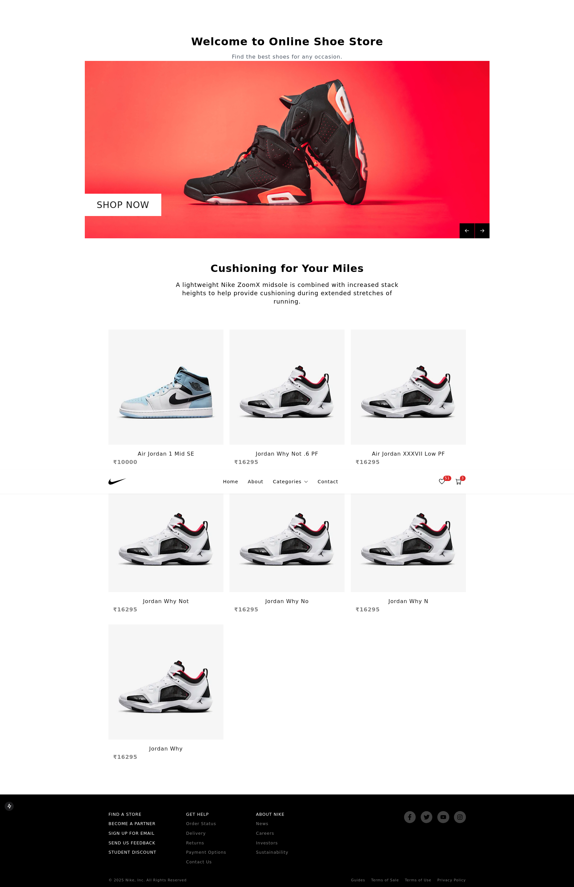
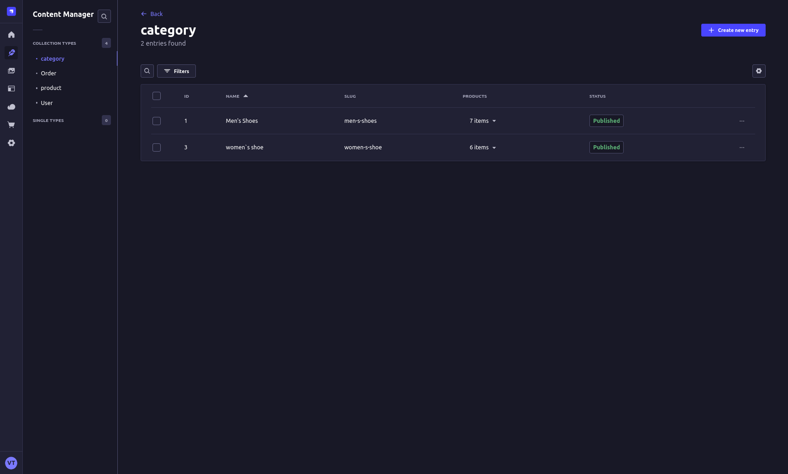
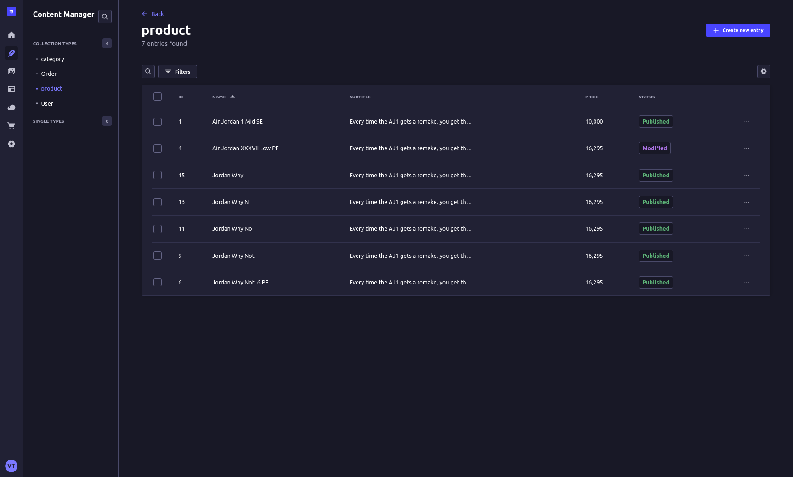

# Shoes store NextJs & Strapi CMS

## Описание
Интернет магазин кроссовок на nextJs & strapi CMS

## Todo
- Избранное
- Заказы
- вход / регестрация

## Скриншоты

DATABASE_CLIENT=postgres
DATABASE_HOST=127.0.0.1
DATABASE_PORT=5443
DATABASE_NAME=shoes
DATABASE_USERNAME=Username
DATABASE_PASSWORD=Password
DATABASE_SSL=false
DATABASE_FILENAME=

Vyacheslav Tchekasin best-login-mail@yandex.ru Monkey123

b2f7b13434c3adae89428194829ffd495067d4c452d56562932d1d993c31a3df8597cb2d5f177d94594170c0f5c46e9b9eb881af5a21b28330ed71b9ecd58e1964fa026899473d40c4e53344625c3d70c623d89a8ffb1b97fade3ce7b7c970b36701e655885e62832446f8a3c42b3f1b2079c30c2fe700f6fe51b22b2674081b